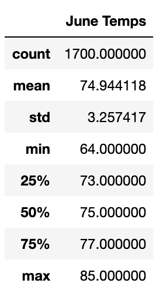
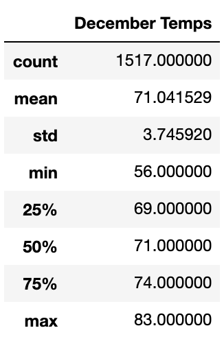

# Surf's Up Analysis

## Overview of Project

W. Avy liked our analysis, and he wants more information about temperature trends. He specifically wants temperature data for the months of June and December in Oahu. This information will help us and W. Avy determine if the surf and ice cream shop business is sustainable all year.

### Purpose

The purpose of this analysis is to gather more data about temperature trends in Oahu during the months of June and December, to determine whether or not a surf and ice cream shop is sustainable all year.

## Results

* `Count`: December has a smaller sample size than June.

* The `standard deviations` between June and December are comparible and relatively small, which means that the data is most likely accurate with few outliers.

* The `minimum temperature` in Decmeber is only eight degrees less than the minimum in July, and the `max` is only two less than July. This shows that the temperature may not affect the number of people that want ice cream.

## Summary

Two additional queries we would perform to gather more weather data for June and December are:

* Query only the station(s) within a certain radius, using the `latitude` and `logitude` columns from the `station` table, from the desired location for the ice cream/surf store to get a more accurate forecast for that location. 

* Query only the station(s) within a certain elevation range, using the `elevation` column from the `station` table, to determine more accurate weather at that elevation.

* Combine the two queries above into one in order to get a "column" of weather data, surrounding the desired shop location.